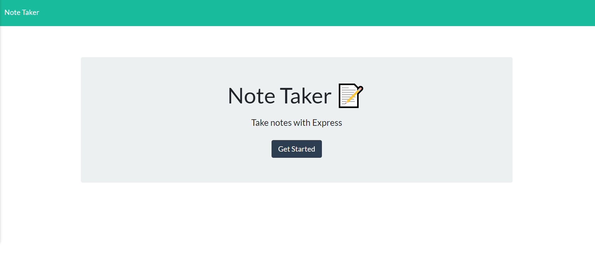
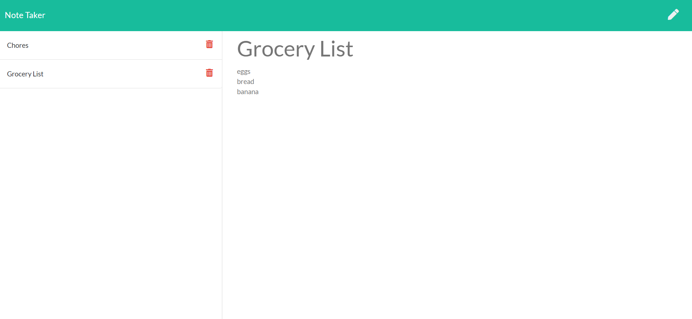

# Note Taker

## Description 

This is a simple note taking application. This app wil allow you to write, save, and delete notes. It uses node.js and express. You can opt to run it on a local server or visit the deployed version here.

## Contents
* [Installation](#Installation)
* [Usage](#Usage)
   * [Screenshots](#Screenshots)
* [Questions](#Questions)
* [Credits](#Credits)

## Installation

To run locally, clone the repo or download it, run `npm install` then run `node server.js`. In your terminal you will be prompted to "click here" on the local host URL. Click it and it will open the app in your browser.

## Usage

The following images show the web application's appearance and functionality: 

### Screenshot

## Questions

Have a question? Contact me on github @heparish 

## Credits

* My amazing tutor Sara, who saves my butt every session. 
* Project created by Haley Parish and her feline desk mate, Charlie.